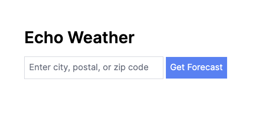
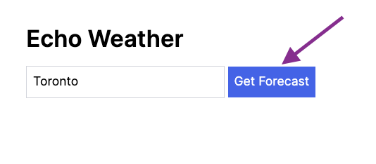
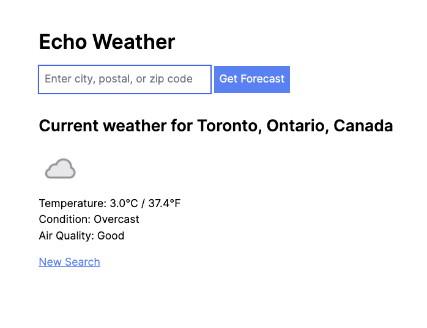

# Echo Weather

Echo Weather is a Ruby on Rails application built to showcase real-time weather data using the [Weather Api](https://www.weatherapi.com/docs/). The project integrates key technical concepts, including Rails controllers, service objects (Interactors), model objects with ActiveModel, and a custom client for Weather API interaction. TailwindCSS is used for styling the views.

## Getting Started

To set up and run the application, follow these steps to install the necessary dependencies, set up the database, and start the development server:

```bash
# Start the Postgres database in a container
docker-compose up

# Install dependencies and prepare database
bin/setup

# Enable dev caching
bin/rails dev:cache

# Start the Rails dev server and TailwindCSS build
bin/dev
```

## Database Initialization

Although the project is set up to use a PostgreSQL database, it is currently not utilized as all the weather data is fetched directly from the Weather API. The database is initialized to handle potential future requirements, such as implementing user logins. In the future, users could save their frequently accessed weather locations or perform other data-related tasks.

## Configuration

### Weather API Key

To get started with the Echo Weather Rails application, you need to obtain an API key from [Weather Api](https://www.weatherapi.com/). Follow these steps:

1. Visit [Weather Api Sign Up](https://www.weatherapi.com/signup.aspx) to create an account.
2. After signing up, you will receive an API key. Copy this key as you'll need it for the next step.

### Setting Up Environment Variables

The application relies on environment variables to securely store sensitive information like API keys. A template file `env.template` is provided. Follow these steps to set up your environment variables:

1. Copy the `env.template` file to a new file named `.env`.

   ```bash
   cp env.template .env
   ```

2. Open the .env file in a text editor.
3. Replace the placeholder `fill_me_in` in the `WEATHER_API_KEY` variable with the API key you obtained from Weather Api.

## Usage

Once the application is running, you can access the weather information by navigating to the root URL: http://localhost:3000/, where you'll be presented with a search form:



Go ahead and enter a city, zip code, or postal code for which you'd like to view the weather, eg: `Toronto`, and then click the "Get Forecast" button or hit <kbd>Enter</kbd>:



This will search the Weather API for the location you entered and display the weather, conditions, and air quality:



Air quality is based on the US - EPA standard. See the "Air Quality Data" section of the [Weather Api Docs](https://www.weatherapi.com/docs/) for further details.

## Testing

Echo Weather uses a combination of RSpec and FactoryBot for automated testing. The test suite includes unit tests for interactors and library components, integration tests (RSpec request type tests), and feature tests (end-to-end tests) using Capybara to simulate user interactions with the web application.

### Running Tests

To run all tests, use the following command:

```bash
bin/rspec
```

To run only the integration (aka request) tests:

```bash
bin/rspec requests
```

To run only the end-to-end (aka feature) tests:

```bash
bin/rspec features
```

## Components

This section explains the major technical areas of the application.

### Routes

The application's routes are defined as follows:

```ruby
Rails.application.routes.draw do
  root "weather#index"
  get "weather/search", to: "weather#search", as: "weather_search"
end
```

### Weather Controller

The `WeatherController` handles the rendering of the weather information. The `index` action displays the default view, while the `search` action delegates to the `SearchWeather` Interactor to fetch and display weather details based on a user-provided address.

### SearchWeather Interactor

The `SearchWeather` Interactor encapsulates the logic for fetching weather data from the Weather API. It includes error handling for potential API errors and uses Rails caching to improve performance. The retrieved data is then structured into a `Weather::Current` model for easy display in the UI.

### Weather::Client

The `Weather::Client` is a custom client responsible for interacting with the Weather API. It handles API requests, error handling, and logging. The client is configured with the API URL and key from environment variables.

### Weather::Current Model

The `Weather::Current` model is designed to collect and structure the Weather API data for easy integration into the UI. It includes attributes such as temperature, condition, air quality, and location details.

## Deployment

When deploying this application to a production environment, it's important to configure caching for optimal performance. The current implementation relies on Rails caching, which in development mode, uses an in-memory store. However, for production deployments, consider setting up Redis or Memcached to handle caching requirements efficiently.

To configure caching for production:

1. Install and configure Redis or Memcached on your production server.
2. Update the caching configuration in the `config/environments/production.rb` file to use your chosen caching solution. See the [Rails Guides on Caching](https://guides.rubyonrails.org/caching_with_rails.html) for further details.
