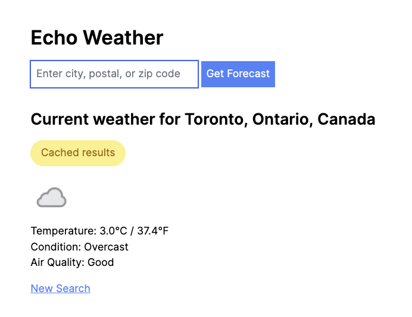

# Echo Weather

Echo Weather is a Ruby on Rails application built to showcase real-time weather data using the [Weather Api](https://www.weatherapi.com/docs/). The project integrates key technical concepts, including Rails controllers, service objects (Interactors), model objects with ActiveModel, and a custom client for Weather API interaction. TailwindCSS is used for styling the views.

## Dependencies

* Install [Docker](https://www.docker.com/) for your OS.
* Install the Ruby version specified in [.ruby-version](.ruby-version) with your preferred Ruby version manager.

## Getting Started

To set up and run the application, follow these steps to install the necessary dependencies, set up the database, and start the development server:

```bash
# Start the Postgres database in a container
docker-compose up

# Install dependencies and prepare database
bin/setup

# Enable dev caching
bin/rails dev:cache

# Start the Rails dev server and TailwindCSS build
bin/dev
```

## Database Initialization

Although the project is set up to use a PostgreSQL database, it is currently not utilized as all the weather data is fetched directly from the Weather API. The database is initialized to handle potential future requirements, such as implementing user logins. In the future, users could save their frequently accessed weather locations or perform other data-related tasks.

## Configuration

### Weather API Key

To get started with the Echo Weather Rails application, you need to obtain an API key from [Weather Api](https://www.weatherapi.com/). Follow these steps:

1. Visit [Weather Api Sign Up](https://www.weatherapi.com/signup.aspx) to create an account.
2. After signing up, you will receive an API key. Copy this key as you'll need it for the next step.

### Setting Up Environment Variables

The application relies on environment variables to securely store sensitive information like API keys. A template file `env.template` is provided. Follow these steps to set up your environment variables:

1. Copy the `env.template` file to a new file named `.env`.

   ```bash
   cp env.template .env
   ```

2. Open the .env file in a text editor.
3. Replace the placeholder `fill_me_in` in the `WEATHER_API_KEY` variable with the API key you obtained from Weather Api.

Restart the dev server after updating the environment variables.

## Usage

Once the application is running, you can access the weather information by navigating to the root URL: http://localhost:3000/, where you'll be presented with a search form:


Go ahead and enter a city, zip code, or postal code for which you'd like to view the weather, eg: `Toronto`, and then click the "Get Forecast" button or hit <kbd>Enter</kbd>:


This will search the Weather API for the location you entered and display the weather, conditions, and air quality:


Air quality is based on the US - EPA standard. See the "Air Quality Data" section of the [Weather Api Docs](https://www.weatherapi.com/docs/) for further details.

Your search query is in the resulting url, for example: http://localhost:3000/weather/search?address=Toronto&commit=Get+Forecast, so you can bookmark it for later or sharing (not the `localhost` version but when its deployed).

To get weather for another location, simply enter another location in the search box, or click the New Search link at the bottom of the results.

Weather results are cached for 30 minutes, so for example, if you search for "Toronto" again within 30 minutes of the first search, you'll get the exact same results with a caching indicator as shown below:



## Testing

Echo Weather uses a combination of RSpec and FactoryBot for automated testing. The test suite includes unit tests for interactors and library components, integration tests (RSpec request type tests), and feature tests (end-to-end tests) using [Capybara](https://github.com/teamcapybara/capybara) to simulate user interactions with the web application.

### Running Tests

To run all tests, use the following command:

```bash
bin/rspec
```

To run only the integration (aka request) tests:

```bash
bin/rspec requests
```

To run only the end-to-end (aka feature) tests:

```bash
bin/rspec features
```

Note that Capybara is currently using the default `:rack_test` driver rather than `:selenium`. This provides the best performance but doesn't support JavaScript. Since this app isn't using a JavaScript single-page-app framework such as React or Vue, the `:rack_test` driver is sufficient. See the Capybara docs on [Selecting the Driver](https://github.com/teamcapybara/capybara?tab=readme-ov-file#selecting-the-driver) for more details.

## Components

This section explains the major technical areas of the application.

### Routes

The application's routes are defined as follows:

```ruby
Rails.application.routes.draw do
  root "weather#index"
  get "weather/search", to: "weather#search", as: "weather_search"
end
```

### Weather Controller

The `WeatherController` handles the rendering of the weather information. The `index` action displays the default view, while the `search` action delegates to the `SearchWeather` Interactor to fetch and display weather details based on a user-provided address. The `search` action renders the results to the same index view, so the user can easily keep doing searches without having to navigate to a new page.

### SearchWeather Interactor

The `SearchWeather` Interactor encapsulates the logic for fetching weather data from the Weather API. It includes error handling for potential API errors and uses Rails caching to improve performance. The retrieved data is then structured into a `Weather::Current` model for easy display in the UI.

### Weather::Client

The `Weather::Client` is a custom client responsible for interacting with the Weather API. It handles API requests, error handling, and logging. The client is configured with the API URL and key from environment variables.

### Weather::Current Model

The `Weather::Current` model is designed to collect and structure the Weather API data for easy integration into the UI. It includes attributes such as temperature, condition, air quality, and location details.

## Deployment

When deploying this application to a production environment, it's important to configure caching for optimal performance. The current implementation relies on Rails caching, which in development mode, uses an in-memory store. However, for production deployments, consider setting up Redis or Memcached to handle caching requirements efficiently.

To configure caching for production:

1. Install and configure Redis or Memcached on your production server.
2. Update the caching configuration in the `config/environments/production.rb` file to use your chosen caching solution. See the [Rails Guides on Caching](https://guides.rubyonrails.org/caching_with_rails.html) for further details.

## Potential Enhancements

This section documents some potential future enhancements that could made to the Echo Weather application.

**Resourceful Routing**

Consider a more RESTful approach to routes such as:

```ruby
# config/routes.rb
Rails.application.routes.draw do
  root "weather#index"

  resources :weather, only: [:index] do
    collection do
      get "search", action: :search, as: "search"
    end
  end
end
```

**Model Input**

The search form currently just specifies an address that is available to the controller via `params[:address]`. This is ok for just a single attribute, but if the search form was enhanced to add further attributes such as advanced search, it might be more convenient to create a model for this, using `ActiveModel` for a model not backed by a database table. Then the form could be bound to the model. This would also support adding validations handled by the model such as declaring required fields.

Something like this:

```ruby
# app/models/weather/search.rb
module Weather
  class Search
    include ActiveModel::Model

    attr_accessor :address, :other_attr, ...

    validates :address, presence: true
  end
end
```

```erb
<%# app/views/weather/index.html.erb %>
<%= form_with(model: weather_search, url: weather_search_path, method: :get) do |form| %>
  <%= form.label :address, "Enter city, postal, or zip code" %>
  <%= form.text_field :address, autofocus: true %>

  <%= form.submit "Get Forecast" %>
<% end %>
```

```ruby
# app/controllers/weather_controller.rb
class WeatherController < ApplicationController
  def index
    @weather_search = Weather::Search.new
  end

  def search
    @weather_search = weather_search_params
    result = SearchWeather.call(address: @weather_search)

    if result.success?
      @weather_current = result.weather_current
      @cached_message = "Cached results" if result.from_cache
    else
      flash.now[:alert] = result.error
    end

    render :index
  end

  private

  def weather_search_params
    params.require(:weather_search).permit(:address, :other_attr)
  end
end
```

Then the `SearchWeather` interactor could check if the model was `valid?` before proceeding.

**5 Day Forecast**

In addition to `/current.json`, the Weather Api also provides a `/forecast.json` endpoint where a number of days from 1 - 14 can be specified to get a forecast for those days. This endpoint also returns the current day's weather. The `Weather::Client` could be enhanced to use this endpoint instead of `/current.json`. The `Weather::Current` model could either be refactored to `Weather::Forecast`, or a new model could be introduced to capture the high/low temperature for the upcoming days. The `SearchWeather` interactor would then have to do more work to parse the forecast response into a suitable model, which could then be rendered in the view.
